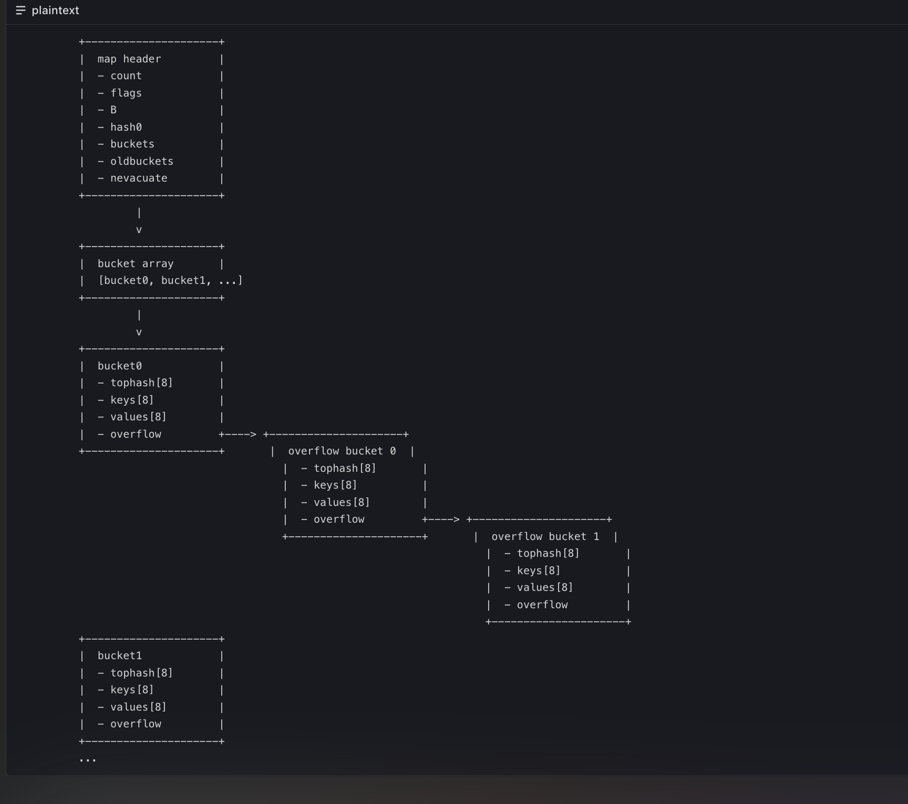

1、%s格式化字符串，%v 格式化任何值
2、分片用append拼接，新拼接的元素地址与被拼接的元素地址是一致的--浅拷贝
copy命令，新数组与原数组的元素地址不一样--深拷贝
3、练习地址：
https://www.liwenzhou.com/--李文周的博客
https://golang.google.cn/learn/--go官网
4、同1个包中，只能有一个main函数，同1个项目中，多个包邮main函数，就算多个应用程序
5、go中map初始化指定大小时，会申请指定大小的内存空间。java中map初始化指定大小时，会申请空间，空间大小是向上取最近的2的幂次方，比如指定大小为10，会申请16的空间
5、go中map的结构,采用数组+链表的结构，map头存储map的信息，后面是数组，元素的hash值计算后存在不同的桶中，数组元素的类型是桶（普通桶），
一个桶最多放8个键值对，超过8，会把后面的键值对放到溢出桶链表中，链表的每个元素也是桶（叫溢出桶），普通桶和溢出桶结构一样，都是8个键值对，map扩容有2种情况
情况1: 键值对的总数量（普通桶和溢出桶）/ 数组长度 > 6.5，扩容为原来的2倍
情况2: (比值没有到6.5时)，map会记录溢出桶的大概数量noverflow，底层源码判断当数量值大于阈值（阈值会根据map的数组长度动态调整）时扩容
情况1触发的扩容会变为原来的2倍，情况二map会对原数组进行调整，数组大小与先前一样，减少溢出桶数量，将键值对均匀分到不同桶中
6、	//defer xxx注册一个函数调用，在方法执行正常/异常结束使用
7、os.O_APPEND|os.O_WRONLY|os.O_CREATE 文件不存在就创建，存在就追加。三者无所谓顺序
os.O_WRONLY 以写入方式打开，文件存在就清空
os.O_CREATE 文件不存在就创建
os.O_APPEND 追加写入,如果不写就是清空文件
os.O_TRUNC 清空文件内容
os.O_RDWR 以读写方式打开
8、go语言中没有@NotNull注解，需要自己写校验逻辑
9、flag.StringVar 如果命令行中某一个值不存在，整体都读取不到
10、git rm -rf --cached . 删除缓存文件
    git add . 提交文件到缓存区
11、